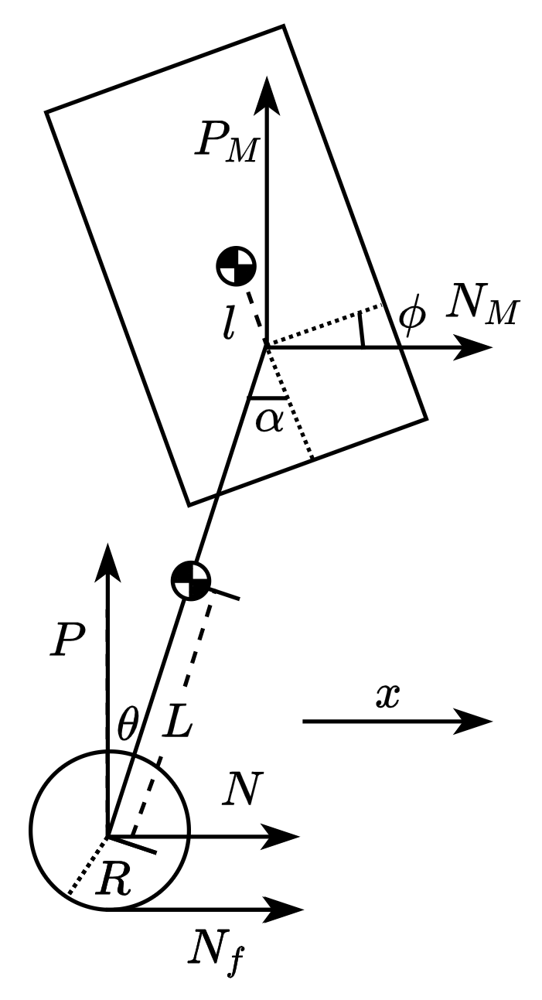

# 2023平衡步兵框架
- [2023平衡步兵框架](#2023平衡步兵框架)
  - [机器人基本信息](#机器人基本信息)
  - [CAN-ID](#can-id)
  - [坐标系设置](#坐标系设置)
  - [LQR版本控制器设计](#lqr版本控制器设计)
  - [系统变量](#系统变量)
  - [| φ | 底盘对地倾角 |](#-φ--底盘对地倾角-)
  - [$$](#)
  - [双板分工](#双板分工)
    - [底盘向云台发送数据](#底盘向云台发送数据)
    - [云台向底盘发送数据](#云台向底盘发送数据)
  - [机器人控制](#机器人控制)
    - [机器人控制状态](#机器人控制状态)
      - [失能模式 MODE\_IDLE](#失能模式-mode_idle)
      - [逃逸模式 MODE\_ESCAPE](#逃逸模式-mode_escape)
      - [正常模式 MODE\_NORMAL](#正常模式-mode_normal)
      - [状态切换操作](#状态切换操作)
    - [机器人底盘运动状态](#机器人底盘运动状态)
      - [底盘跟随](#底盘跟随)
      - [对线模式](#对线模式)
  - [机器人操纵](#机器人操纵)
    - [机器人状态控制](#机器人状态控制)
    - [机器人移动](#机器人移动)
      - [Escape Mode](#escape-mode)
      - [Shuttle Mode](#shuttle-mode)
      - [Side Mode](#side-mode)
      - [Flying Mode](#flying-mode)
      - [Jump](#jump)
    - [机器人云台移动](#机器人云台移动)
    - [机器人发射](#机器人发射)


---
## 机器人基本信息
操作系统
- ThreadX V6.1.7
- CubeMX套件 V1.1

---
## CAN-ID

- M2006  0x301
- L3508  0x302
- R3508  0x303
- Y6020  0x305
- P6020  0x306
- GY-H1  Chasis 1
- GY-H1  Gimbal 2
- 控制器底盘 0x101
- 控制器云台 0x102

---

## 坐标系设置 
   

- 关节电机坐标如图   
- 除关节外, 底盘、云台按前左上
- 关节电机中点为原点  
- 控制左右关节式均以右视图进行透视
- 五连杆逆时针旋转Theta为正
- 腿最短时校准8016编码器以实现0位(电机角度为5d与175d)
---

## LQR版本控制器设计
本版本控制器基于哈工程设计。本坐标系中测量量需要进行转换后输入LQR。  


> 已经尝试将状态空间方程中的变量换算到本坐标系，但均失败。哈工程坐标系选取是合理的

>It seems that Github website cannot render matrix correctly.


---
## 系统变量   

$$
x = 
\begin{bmatrix}
  \theta        \\
  \dot{\theta}  \\
  x_b             \\
  \dot{x_b}       \\
  \phi          \\
  \dot{\phi}
\end{bmatrix}

u = 
\begin{bmatrix}
  T        \\
  T_p  \\
\end{bmatrix}
$$

---
| 变量名 | 解释 |
|-------|-------|
| θ | 倒立摆对地摆角 |
| xb | 机身位移 |
| φ | 底盘对地倾角 |
---
变量换算方式
$$
\phi = -\phi_{pitch}\\
\theta = \theta_{FC} - \phi - \frac{\pi}{2}
$$
---
| 变量名 | 解释 | 测量方式 |
|-------|-------|-------|
| φpitch | 底盘坐标系下底盘对地倾角 | 底盘IMU Pitch角 | 
| θFC | 关节坐标系下倒立摆摆角 | 五连杆正运动学 |

---

## 双板分工
底盘作为机器人控制, 运算核心;云台作为从控制模块, 控制云台转动及发射     
云台与底盘间通讯使用固定结构体与CAN通讯进行。 数据包亦是心跳包, 组件掉线处理通过包接收时间判定。

### 底盘向云台发送数据
> CANID:0x101  
> STDID  
> Len = 5

|CANID  | Data[00]    | Data[01]    | Data[02]    | Data[03]    | Data[04]    |
|------------|------------|------------|------------|------------|------------|
|0x101 | YAWL | YAWH | PITCHL | PITCHH | FLAG |


``` C
typedef __PACKED_STRUCT
{
	int16_t YawInc;            //Yaw增量  -10000~10000表示-PI~PI 其他表示失能
	int16_t PitInc;            //Pitch增量 -10000~10000表示-PI~PI 其他表示失能
	uint8_t Fire  : 1;         //开火标志位
	uint8_t BoosterMode  : 2;  //摩擦轮射速模式
	uint8_t TriggleMode  : 2;  //拨盘模式
	uint8_t CapOpen      : 1;  //是否开启弹舱盖
	uint8_t GimDeathFlag : 1;  //云台关断标记位
	uint8_t RobotDeath   : 1;  //机器人阵亡标志位
}tComDown;
```
摩擦轮射速模式
| ModeOFF | Mode0 | Mode1 | Mode2 |
|------------|------------|------------|------------|
| 摩擦轮关闭 | 15m/s | 18m/s | 30m/s |

拨盘模式
| ModeOFF | Mode0 | Mode1 | Mode2 |
|------------|------------|------------|------------|
| 拨盘关闭 | 拨盘连发模式0 | 拨盘连发模式1 | 拨盘单发 |

### 云台向底盘发送数据
> CANID:0x102  
> STDID  
> Len = 1

``` C
typedef __PACKED_STRUCT
{
	uint8_t ShootStatue : 2;	//发射状态
	uint8_t AmmoCap		: 2;	//弹舱容量
	uint8_t Reserved	: 4;	//暂留
}tComUP;
```

发射状态
| STATUE0 | STATUE1 | STATUE2 | STATUE3 |
|------------|------------|------------|------------|
| 空闲 | 发射中 | 卡弹 | 卡弹处理 |

弹舱容量
| STATUE0 | STATUE1 | STATUE2 | STATUE3 |
|------------|------------|------------|------------|
| >75% | >50% | >25% | 0% |


---
## 机器人控制   

### 机器人控制状态
#### 失能模式 MODE_IDLE
>关闭机器人全部电机
#### 逃逸模式 MODE_ESCAPE
>机器人云台正常, 发射正常, 关节电机关闭, 轮电机开环控制
#### 正常模式 MODE_NORMAL
>机器人全部状态正常 

#### 状态切换操作
>执行状态切换时, 错误标识符不会被清除   
> STATUS_IDLE -> STATUS_START -> STATUS_NORMAL   
> 切换状态必须

### 机器人底盘运动状态
>机器人状态为正常模式
#### 底盘跟随
> 尽量节省功率情况下保持底盘对齐云台  
> 机器人运动状态下，底盘时刻对云台姿态保持跟踪  
> 机器人站定状态下，机器人底盘将不响应云台的小幅度旋转  [+-30D]
#### 对线模式
> 严格保持机器人底盘对云台的法向

---
## 机器人操纵   

### 机器人状态控制
RobotStatue is only determinded by SW1, which means keyboard can not change that.
> Direction is in operator's side

Remoter's rule is as fellow:
| SW1 Place | RobotMode |
|-----|-----|
| Top | IDLE |
| Mid | ESCAPE |
| Down | NORMAL |

>In any mode and any statue, click Z would change robot into IDLE mode

> In code, to adapt DT6 or MC7, switch is remap to 1-2-3 in the order of Top-Mid-Down.

In **Idle mode**, robot get into a safe mode. All parts are disabled. This mode is desigend for checking robot or move robot. When robot power on, it will get into this mode firstly.

**Escape mode** is designed for situation, which robot get stuck in a narrow place. In Escape mode, balance function will be disable. Wheel motor will get into an open-loop mode. However, gimbal will get into normal mode as ammbooster. 

**Normal mode** means all parts work normally.

### 机器人移动
Robot can move in **Escape mode** and **Normal mode**.

#### Escape Mode
In Escape mode, robot chasis is under open-loop control, while robot won't keep banlance. The postive direction of chasis is the normal directon of the closest armor.

| Key | Function | Triggering Condition |
|-----|-----|-----|
| CH2 | Spin | Push-Pull |
| CH3 | Shuttle Moving| Push-Pull |
| W   | Forward Moving| Press On|
| S   | Backward Moving| Press On|
| A   | Spin Left | Press On|
| D   | Spin Right | Press On|
| Shift   | Boost moving speed | Press On|


#### Shuttle Mode
In shuttle mode, robot chasis is under close-loop controd. While moving, chasis will follow gimbal. Functions like side-mode, jumping will enable. 

| Key | Function | Triggering Condition |
|-----|-----|-----|
| CH2 | Rotate | Push-Pull |
| CH2 | Side-mode | Push-Pull to End |
| CH3 | Shuttle Moving | Push-Pull |
| W   | Forward Moving| Press on |
| S   | Backward Moving| Press On|
| A   | Rotate Left | Press On|
| D   | Rotate right | Press On |
| Q   | Turn to Side Mode | Press Click|
| E   | Keep chasis coincidiently follow gimbal | Press Click |
| G   | Turn to Flying Mode | Press Click|
| C   | Reduce Leg Length | Press Click|
| V   | Add Leg Length | Press Click|
| WHEEL   | Change Leg Length | Push-Pull to End while SW2==1 |
| Ctrl+F   | Jump | Press Click|


#### Side Mode
Robot will turn armor one side to elude ammo. Move shuttle will auto exit this mode.   
Chasis folow gimbal in 90d or -90d(decided on the closet armor).
| Key | Function | Triggering Condition |
|-----|-----|-----|
| CH2 | Moving Left oRight | Push-Pull |
| W   | Moving Left Side | Press On|
| S   | Moving Right Side | Press On|
| CH3 | Quit SideMode | Push-Pull |
| A   | Quit SideMode | Long Press On |
| D   | Quit SideMode | Long Press On |
| E   | Quit SideMode | Press On |
| C   | Reduce Leg Length | Press Click|
| V   | Add Leg Length | Press Click|
| WHEEL   | Change Leg Length | Push-Pull to End while SW2==1 |


#### Flying Mode
Robot will turn armor one side to elude ammo. Move shuttle will auto exit this mode.

#### Jump
Robot will turn armor one side to elude ammo. Move shuttle will auto exit this mode.

### 机器人云台移动
Robot Gimbal is active in both **Escape mode** and **Normal mode**. And it acts same.

| Key | Function | Triggering Condition |
|-----|-----|-----|
| CH0 | Rotate Yaw Axis | Push-Pull |
| CH1 | Rotate Pitch Axis | Push-Pull |
| MouseX | Rotate Yaw Axis | Press On |
| MouseY | Rotate Pitch Axis | Press On|

### 机器人发射
Robot AmmoBooster is active in both **Escape mode** and **Normal mode**. And it acts same.

| SW2 Place | ShootMode |
|-----|-----|
| Top | IDLE |
| Mid | OneShot |
| Down | MultiShot |
> In code, to adapt DT6 or MC7, switch is remap to 1-2-3 in the order of Top-Mid-Down.

| Key | Function | Triggering Condition |
|-----|-----|-----|
| SW2 | Change Shoot Mode | Switch |
| B  | Change Shoot Mode | Press Click |
| R  | Open/Close Cap | Press Click |
| Wheel | Open/Close Cap | Push Timewise |
| Wheel | Open Fire | Push Anti-Timewise |
| Mouse Left | Shoot | Press On |
| Mouse Right | AutoAiming | Press On |