# 2023 轮腿平衡机器人框架
- [2023 轮腿平衡机器人框架](#2023-轮腿平衡机器人框架)
  - [机器人基本信息](#机器人基本信息)
  - [坐标系设置](#坐标系设置)
  - [LQR版本控制器设计](#lqr版本控制器设计)
  - [系统变量](#系统变量)
  - [机器人控制](#机器人控制)
    - [机器人控制状态](#机器人控制状态)
      - [失能模式 MODE\_IDLE](#失能模式-mode_idle)
      - [逃逸模式 MODE\_ESCAPE](#逃逸模式-mode_escape)
      - [正常模式 MODE\_NORMAL](#正常模式-mode_normal)
      - [状态切换操作](#状态切换操作)
    - [机器人底盘运动状态](#机器人底盘运动状态)
  - [机器人操纵](#机器人操纵)
    - [机器人状态控制](#机器人状态控制)
    - [机器人移动](#机器人移动)
      - [Escape Mode](#escape-mode)
      - [Shuttle Mode](#shuttle-mode)
      - [Jump](#jump)

## 机器人基本信息
操作系统
- ThreadX V6.1.7
- CubeMX ThreadX 套件 V1.1

## 坐标系设置 
   

- 关节电机坐标如图   
- 除关节外, 底盘、云台按前左上
- 关节电机中点为原点  
- 控制左右关节式均以右视图进行透视
- 五连杆逆时针旋转Theta为正
- 校准时，单侧关节上臂抵限位时置0，补偿角度 0.34472f rad

## LQR版本控制器设计
本版本控制器基于哈工程设计。本坐标系中测量量需要进行转换后输入LQR。  

> 已经尝试将状态空间方程中的变量换算到本坐标系，但均失败。哈工程坐标系选取是合理的

>It seems that Github website cannot render matrix correctly.

---
## 系统变量   
系统变量如下:
$$
x = 
\begin{bmatrix}
  \theta        \\
  \dot{\theta}  \\
  x_b             \\
  \dot{x_b}       \\
  \phi          \\
  \dot{\phi}
\end{bmatrix}

u = 
\begin{bmatrix}
  T        \\
  T_p  \\
\end{bmatrix}
$$

| 变量名 | 解释 |
|-------|-------|
| θ | 倒立摆对地摆角 |
| xb | 机身位移 |
| φ | 底盘对地倾角 |
   

需要换算的三个变量的换算方式:

$$
\phi = -\phi_{pitch}\\
\theta = \theta_{FC} - \phi - \frac{\pi}{2}
$$

| 变量名 | 解释 | 测量方式 |
|-------|-------|-------|
| φpitch | 底盘坐标系下底盘对地倾角 | 底盘IMU Pitch角 | 
| θFC | 关节坐标系下倒立摆摆角 | 五连杆正运动学 |

## 机器人控制   

### 机器人控制状态
#### 失能模式 MODE_IDLE
>关闭机器人全部电机
#### 逃逸模式 MODE_ESCAPE
>机器人云台正常, 发射正常, 关节电机关闭, 轮电机开环控制
#### 正常模式 MODE_NORMAL
>机器人全部状态正常 

#### 状态切换操作
>执行状态切换时, 错误标识符不会被清除   
> STATUS_IDLE -> STATUS_START -> STATUS_NORMAL   
> 切换状态必须

### 机器人底盘运动状态
>机器人状态为正常模式

---
## 机器人操纵   

### 机器人状态控制
RobotStatue is only determinded by SW1, which means keyboard can not change that.
> Direction is in operator's side

Remoter's rule is as fellow:
| SW1 Place | RobotMode |
|-----|-----|
| Top | IDLE |
| Mid | ESCAPE |
| Down | NORMAL |

>In any mode and any statue, click Z would change robot into IDLE mode

> In code, to adapt DT6 or MC7, switch is remap to 1-2-3 in the order of Top-Mid-Down.

In **Idle mode**, robot get into a safe mode. All parts are disabled. This mode is desigend for checking robot or move robot. When robot power on, it will get into this mode firstly.

**Escape mode** is designed for situation, which robot get stuck in a narrow place. In Escape mode, balance function will be disable. Wheel motor will get into an open-loop mode. However, gimbal will get into normal mode as ammbooster. 

**Normal mode** means all parts work normally.

### 机器人移动
Robot can move in **Escape mode** and **Normal mode**.

#### Escape Mode
In Escape mode, robot chasis is under open-loop control, while robot won't keep banlance. The postive direction of chasis is the normal directon of the closest armor.

| Key | Function | Triggering Condition |
|-----|-----|-----|
| CH2 | Spin | Push-Pull |
| CH3 | Shuttle Moving| Push-Pull |

#### Shuttle Mode
In shuttle mode, robot chasis is under close-loop controd. While moving, chasis will follow gimbal. Functions like side-mode, jumping will enable. 

| Key | Function | Triggering Condition |
|-----|-----|-----|
| CH2 | Rotate | Push-Pull |
| CH3 | Shuttle Moving | Push-Pull |

#### Jump
Robot will turn armor one side to elude ammo. Move shuttle will auto exit this mode.
